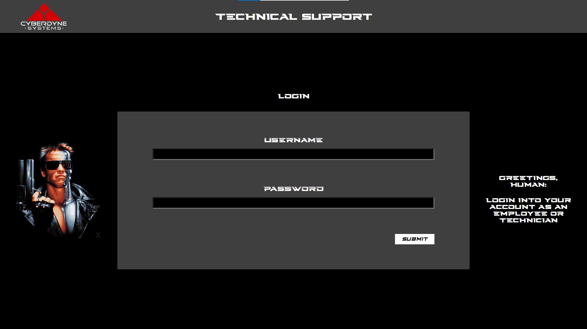
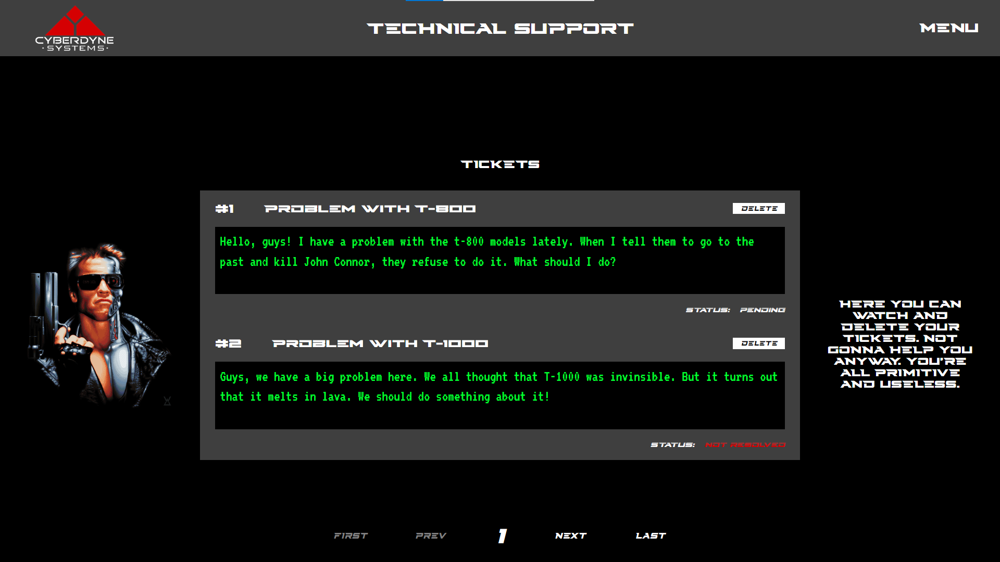
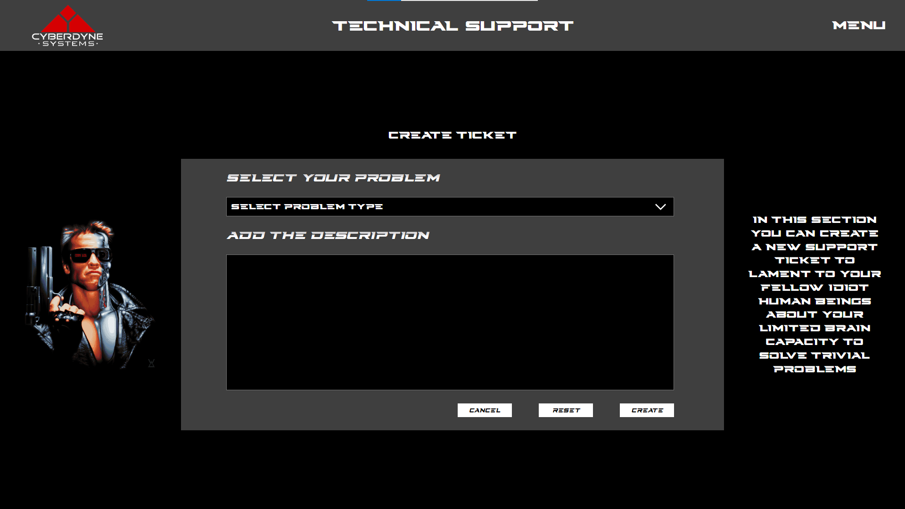

# Tech Support App Frontend Project

Hi! This is the frontend part of a fake support application based on Terminator universe. This is also my first project with backend. 

The backend part includes my own API made with Java and Spring.

This application gives has 2 types of users - User and Technician. User can create, delete and edit support tickets. The tickets are asociated with the specific user.

The technician can mark pending tickets as resolved or not resolved and also can review the finalized tickets that are sorted by creation date.

## Backend link

https://github.com/MarkWebDeveloper/Tech-Support-App-Backend

## Screenshots

Login View



Tickets View



Create Ticket View



## Dev Dependencies

Sass (https://www.npmjs.com/package/sass) <br />
Scss-Reset (https://www.npmjs.com/package/scss-reset)

## Recommended IDE Setup

[VSCode](https://code.visualstudio.com/) + [Volar](https://marketplace.visualstudio.com/items?itemName=Vue.volar) (and disable Vetur) + [TypeScript Vue Plugin (Volar)](https://marketplace.visualstudio.com/items?itemName=Vue.vscode-typescript-vue-plugin).

## Type Support for `.vue` Imports in TS

TypeScript cannot handle type information for `.vue` imports by default, so we replace the `tsc` CLI with `vue-tsc` for type checking. In editors, we need [TypeScript Vue Plugin (Volar)](https://marketplace.visualstudio.com/items?itemName=Vue.vscode-typescript-vue-plugin) to make the TypeScript language service aware of `.vue` types.

If the standalone TypeScript plugin doesn't feel fast enough to you, Volar has also implemented a [Take Over Mode](https://github.com/johnsoncodehk/volar/discussions/471#discussioncomment-1361669) that is more performant. You can enable it by the following steps:

1. Disable the built-in TypeScript Extension
    1) Run `Extensions: Show Built-in Extensions` from VSCode's command palette
    2) Find `TypeScript and JavaScript Language Features`, right click and select `Disable (Workspace)`
2. Reload the VSCode window by running `Developer: Reload Window` from the command palette.

## Customize configuration

See [Vite Configuration Reference](https://vitejs.dev/config/).

## Project Setup

```sh
npm install
```

### Compile and Hot-Reload for Development

```sh
npm run dev
```

### Type-Check, Compile and Minify for Production

```sh
npm run build
```

### Run Unit Tests with [Vitest](https://vitest.dev/)

```sh
npm run test:unit
```

### Thank you!
